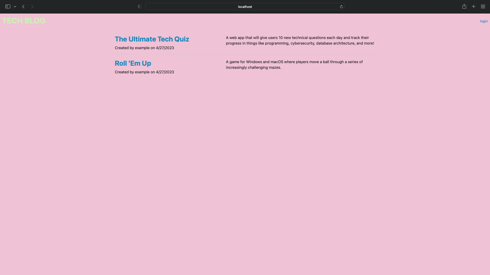
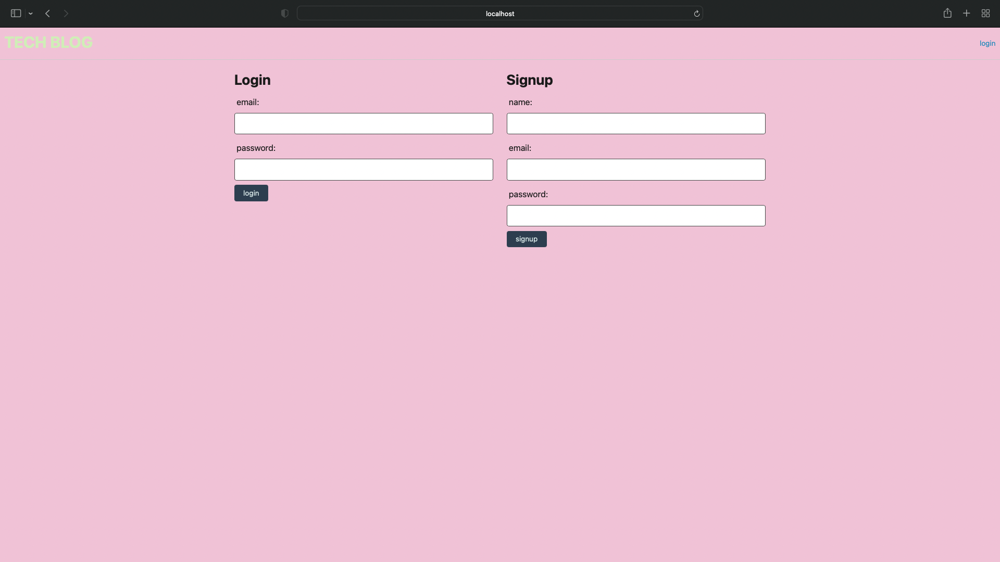
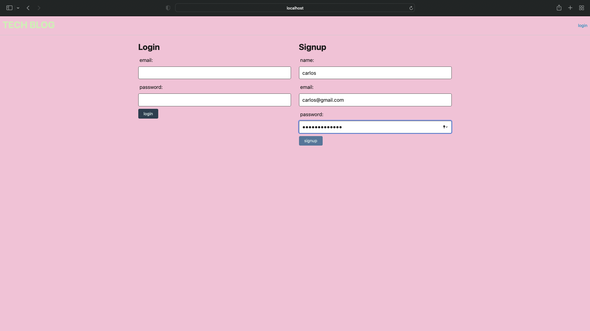
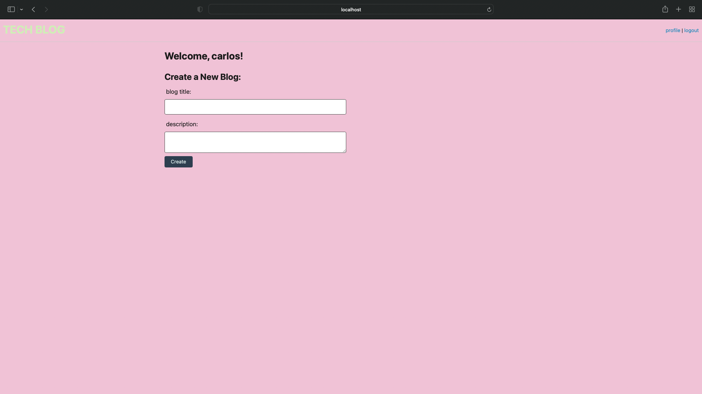
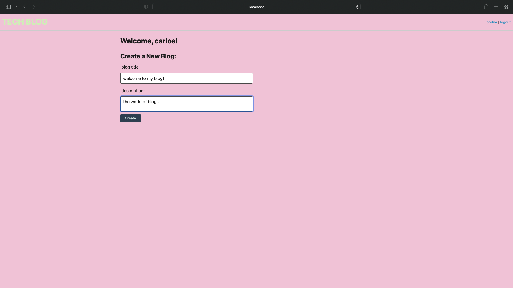
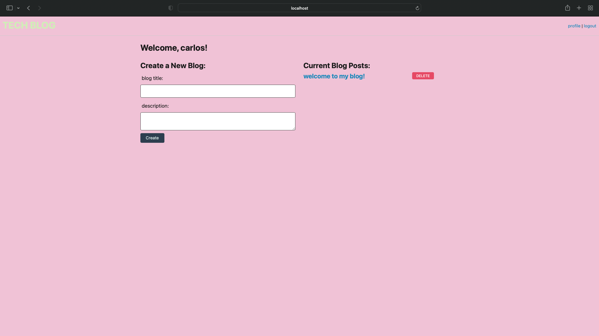
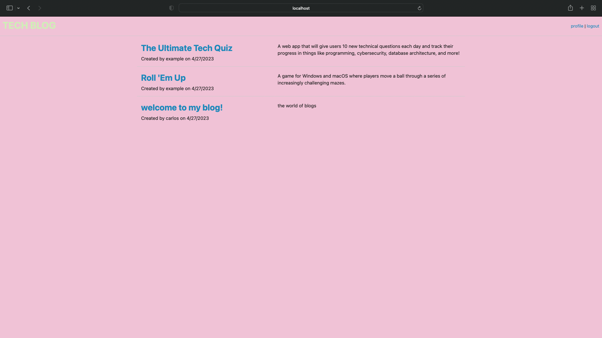

# Carlos's Tech Blog Website

## Description
This website allows users or anyone to post about tech, and what they know or learned about tech 
that the can share with others around the world.

## Acceptance criteria
WHEN I visit the site for the first time
THEN I am taken to the homepage
WHEN I choose to sign up
THEN I am prompted to create a username and password
WHEN I click on the sign-up button
THEN my user credentials are saved and I am logged into the site
WHEN I click on the button to add a new blog post
THEN I am prompted to enter both a title and contents for my blog post
WHEN I click on the button to create a new blog post
THEN the title and contents of my post are saved and I am taken back to an updated dashboard with my new blog post

## Usage
to use this development, you will have to run Npm install then Npm start

## licence
None

## Questions
My GitHub is CARLIYS, and my Email is carlosvargas3200@gmail.com

